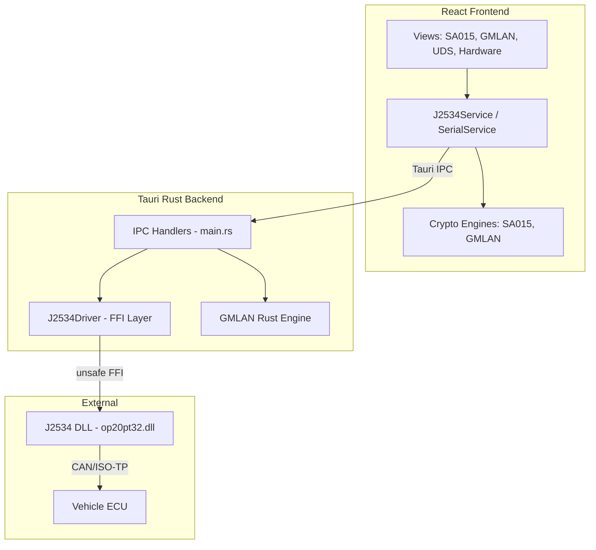

# GM Global A Key Tools (Enterprise Edition)

A production-grade, high-performance diagnostic toolkit for **General Motors Global A** architectures. This application utilizes a hybrid **Tauri (Rust) + React** architecture to provide direct J2534 hardware control for Seed/Key locking, UDS diagnostics, and network discovery.


---

## 🏗 System Architecture

The application implements a **Hexagonal Architecture** (also known as Ports and Adapters) to decouple the UI from the protocol logic and hardware transport layers.



### 1. The Core Domain (`src/core`)

Pure TypeScript implementations of cryptographic algorithms, independent of any UI or hardware.

- **SA015 (Global A)**: Implements the "Unsafe" SHA-256 + AES extension used by GM.
  - _Logic_: `SHA256(Seed + Secret) -> AES_Encrypt(Key)`.
  - _Compatibility_: Supports all 255 algorithm variants via `sa015_data.ts` (Blob mapping).
- **GMLAN (Legacy)**: Implements the 16-bit Seed/Key algorithm for older modules.
  - _Performance_: Ported to **Rust** (`gmlan.rs`) for O(n) brute-force capabilities (checking all 256 algorithms < 10ms).

### 2. Hardware Abstraction Layer (`HardwareService`)

A unified interface allows the application to run seamlessly in two modes:

1.  **Native Desktop (Production)**: Uses `J2534Service`. Accesses the Rust backend via Tauri IPC. Talks natively to J2534 DLLs (Tactrix, Mongoose).
2.  **Web Browser (Dev/Mobile)**: Uses `SerialService`. Uses the Web Serial API (Chrome) to talk to ELM327/STN1170 Bluetooth/USB dongles.

### 3. Rust Backend (`src-tauri`)

The powerhouse of the application. It handles low-level FFI (Foreign Function Interface) with Windows Drivers.

- **Dynamic Linking**: Uses `libloading` to load arbitrary J2534 DLLs (`op20pt32.dll`, etc.) at runtime without recompilation.
- **Protocol Implementation**:
  - **ISO15765 / CAN**: Full support for multi-frame messaging (ISO-TP) and raw CAN frames.
  - **Filtering**: Implements `PassThruStartMsgFilter` to isolate traffic for specific headers (e.g., listening only for `0x7E8` logic).

---

## 🛠 Technical Deep Dive

### J2534 PassThru Bridge (`j2534.rs`)

The Rust backend creates a `J2534Driver` struct that wraps `unsafe` C-calls.

```rust
// Dynamic connection with arbitrary Baud Rate
pub fn connect_can(&mut self, baud: u32, flags: u32) -> Result<(), J2534Error> {
    // Maps to the C-function: PassThruConnect(DeviceId, Protocol, Flags, Baud, &ChannelId)
    // Supports 500k (High Speed), 33.3k (SWCAN), etc.
}
```

### Network Scanner

The application includes a heuristic scanner to discover active modules on the CAN bus.

- **Method**: Iterates through the `ECU_DATABASE` (Standard GM IDs: `0x7E0`, `0x241`, etc.).
- **Ping**: Sends `TesterPresent (3E 00)` or `ReadDataByIdentifier (1A 90)` to each ID.
- **Detection**: Analyses response (Positive `0x7E` or Negative `0x7F`) to confirm module presence.

### Cryptography & Security

- **SA015**: Uses `window.crypto.subtle` for hardware-accelerated SHA-256 in the frontend.
- **GMLAN**: Implements a complete virtual machine for the 16-bit algorithm, supporting opcodes like `ROL`, `ROR`, `SWAP_ADD`, `COMPLEMENT`.

---

## 🚀 Getting Started

### Prerequisites

- **Node.js**: v18+
- **Rust**: Latest Stable (cargo)
- **J2534 Interface**: Tactrix OpenPort 2.0, Mongoose, or similar (Drivers must be installed).

### Development (Native)

```bash
# 1. Install Dependencies
npm install

# 2. Run in Native Mode (Tauri)
# This compiles the Rust backend and launches the WebView
npm run tauri dev
```

### Development (Browser/Mock)

```bash
# Run only the React Frontend (mocks hardware)
npm run dev
```

---

## 📂 Project Structure

```bash
├── src/
│   ├── core/              # Crypto Engines (SA015, GMLAN)
│   ├── data/              # Static Data (Module IDs, Algorithms)
│   ├── services/          # Adapter Pattern (Serial vs J2534)
│   ├── components/        # React UI (Views, Controls)
│   └── App.tsx            # Main Layout & Sidebar
├── src-tauri/
│   ├── src/
│   │   ├── j2534.rs       # UNSAFE: J2534 C-Interop
│   │   ├── gmlan.rs       # RUST: High-perf Algo Implementation
│   │   └── main.rs        # IPC Command Handlers
│   └── Cargo.toml         # Rust Dependencies
└── README.md
```

## ⚠️ Legal & Disclaimer

**Educational Use Only.**
This software is intended for authorized diagnostics and repair scenarios. The authors are not responsible for any misuse, damage to ECUs, or legal consequences arising from the use of this tool. Reverse engineering protocols may void vehicle warranties.
